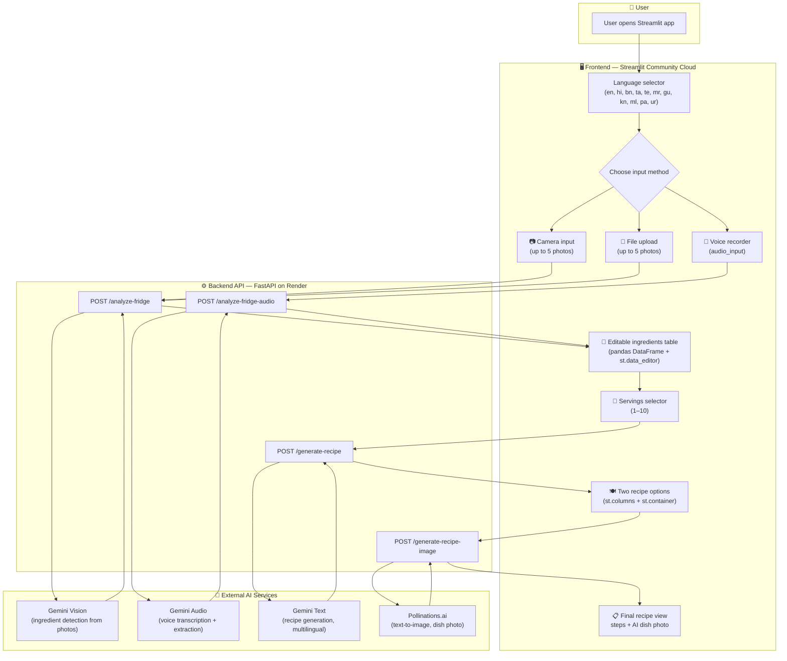
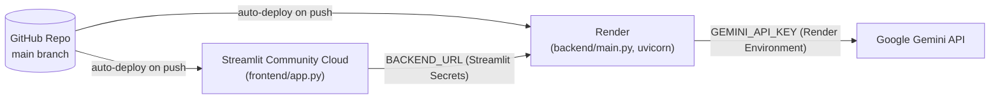

# 🏗️ FoodRescue AI — System Architecture

This diagram shows how a request flows through FoodRescue AI, from the user's camera/upload/voice input all the way to a generated recipe with an AI dish photo.

---

## Component Overview

| Component | Responsibility |
|---|---|
| **Streamlit Frontend** | UI, session state, language switching, calling the backend API, rendering results |
| **FastAPI Backend** | Stateless API layer — receives images/audio/JSON, builds Gemini prompts, calls Gemini + Pollinations.ai, returns clean JSON |
| **Gemini Vision** | Detects ingredients from up to 5 fridge photos per request |
| **Gemini Audio** | Transcribes a voice note and extracts only the ingredient names |
| **Gemini Text** | Generates 2 complete recipes (name, prep time, servings, steps) in the selected language |
| **Pollinations.ai** | Free text-to-image API used to generate a preview photo of the finished dish |

## Deployment Topology

- **Frontend** and **backend** live in the *same* GitHub repo but are deployed as two separate services that talk to each other over HTTPS.
- The frontend never talks to Gemini or Pollinations.ai directly — all AI calls go through the backend, keeping the `GEMINI_API_KEY` server-side only.

